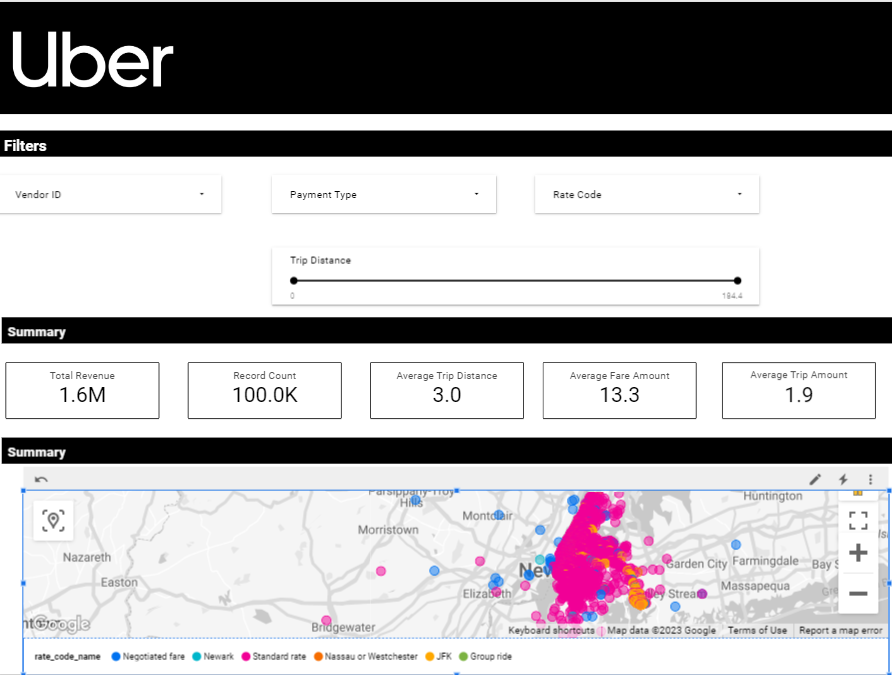

# Uber Data Analytics | Modern Data Engineering GCP Project

## Introduction

This project demonstrates a comprehensive ETL (Extract, Transform, Load) pipeline designed to process Uber trip records data. The pipeline is designed to fetch data from the official TLC Trip Record Data provided by New York City's Taxi and Limousine Commission (TLC) for both yellow and green taxi trips. The dataset contains crucial information such as pick-up and drop-off dates/times, precise locations, distances traveled, fare details, rate types, payment methods, and passenger counts, all meticulously reported by the drivers.

## Dataset

The dataset used in this project is the TLC Trip Record Data for yellow and green taxi trips. It offers a comprehensive collection of information related to Uber trips in New York City. To access the dataset, please follow the link below:

Uber Data CSV -https://github.com/balasai24/Uber-Data-Engineering/blob/main/uber_data%20(1).csv

For a deeper understanding of the dataset's structure and field descriptions, refer to the following resources:

1. Website - https://www.nyc.gov/site/tlc/about/tlc-trip-record-data.page
2. Data Dictionary - https://www.nyc.gov/assets/tlc/downloads/pdf/data_dictionary_trip_records_yellow.pdf

## Architecture 

## Technology Used
- Programming Language - Python
- Programming Language - Sql

Google Cloud Platform
1. Google Storage
2. Compute Instance 
3. BigQuery
4. Looker Studio

## Project Steps
This project follows a step-by-step process to build the Uber ETL pipeline:

## Step 1: Data Acquisition
To start, obtain the TLC Trip Record Data for yellow and green taxi trips. You can download the dataset using the provided link or visit the official NYC TLC Trip Record Data website. This step ensures you have the necessary data to proceed with the pipeline.

## Step 2: Data Modeling
In this step, you will learn about data modeling concepts such as fact and dimension tables. Fact tables contain core numerical data, while dimension tables provide descriptive attributes to provide context for the fact data. Understanding these concepts is crucial for designing an effective data model that enables efficient analysis and reporting.

## Step 3: Data Table creation
Using Jupyter Notebook, the data is read and transformed. This step involves performing various transformations such as data cleaning, dropping duplicates, reindexing, and restructuring the dataset.I learned how to apply these transformations to ensure data quality and consistency for downstream processing.

## Step 4: Data Loading,Transformation & Extraction
The data is loaded into Google Storage, a scalable and reliable cloud storage solution. Additionally, a Compute Instance is set up to install and run MageAI, a tool used for data extraction, transformation, and loading. This step introduces me to the process of loading data into a cloud storage system, which is a crucial component of the ETL pipeline.

Modern Data Pipeine Tool - https://www.mage.ai/

## Step 5: BigQuery Analytics
Leveraging the power of Google BigQuery, a fully-managed data warehouse, this step focuses on executing SQL queries to create the final analytical table.I learned how to use SQL queries to perform advanced analytics on the Uber trip data. BigQuery provides efficient data storage, retrieval, and querying capabilities, enabling me to gain valuable insights from the data.

## Step 6: Dashboard Visualization
The project concludes by creating an interactive dashboard using Looker, a powerful data visualization and business intelligence platform. The dashboard visualizes the analytical results, making it easier to derive insights and present the findings to stakeholders. Through this step, I learned how to create visually appealing and informative dashboards that facilitate data exploration and interpretation.

link to Dashboard -https://lookerstudio.google.com/reporting/94b3731d-56a9-4356-8163-fbc2d6eef6ee

## Project Challenges
During the project, I encountered several challenges that affected the performance of the data pipeline. One major difficulty was related to system limitations with MageAI, which would frequently shut down, causing time delays in data transformation and loading. These delays had a notable impact on the pipeline's efficiency and required additional efforts in troubleshooting and optimization.

To address these challenges, I recommend allocating sufficient system resources and optimizing the MageAI environment to ensure smooth and uninterrupted processing. Additionally, implementing robust error handling mechanisms and monitoring systems can help detect and resolve issues promptly, minimizing their impact on the pipeline's performance.

